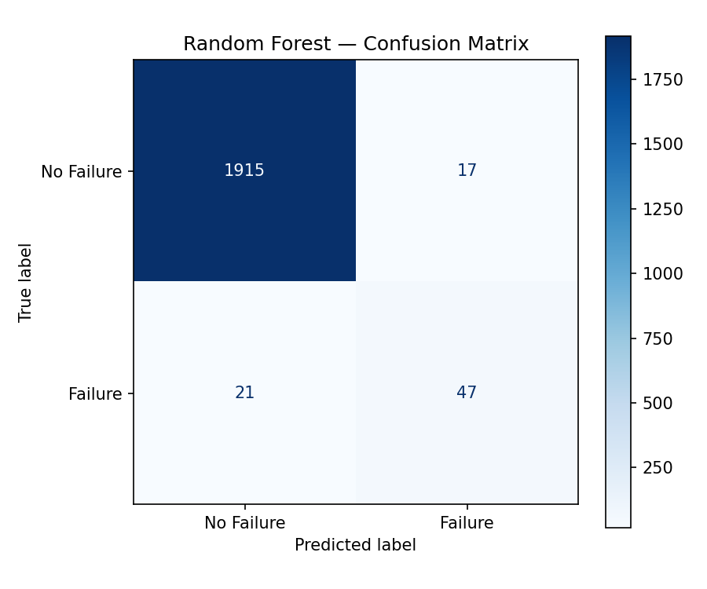

# Predictive-Maintenance-ML

A binary classification project that predicts industrial machine failures using sensor telemetry data, built to explore how machine learning can support proactive maintenance scheduling.

## Dataset

[AI4I 2020 Predictive Maintenance Dataset](https://archive.ics.uci.edu/dataset/601/ai4i+2020+predictive+maintenance+dataset) — 10,000 rows of synthetic but realistic industrial machine data, including:

- Air and process temperature
- Rotational speed and torque
- Tool wear
- Product quality type (Low / Medium / High)
- Machine failure label, plus five failure-mode sub-flags (TWF, HDF, PWF, OSF, RNF)

The dataset is imbalanced: only 3.39% of records (339 of 10,000) represent an actual machine failure.

## Approach

1. **Data cleaning** — dropped non-predictive identifier columns (`UDI`, `Product ID`).
2. **Leakage prevention** — excluded the five failure-mode sub-flags (`TWF`, `HDF`, `PWF`, `OSF`, `RNF`) from the feature set. These flags record the cause of a failure, so they effectively determine the label, and including them would let the model "cheat" by seeing the answer.
3. **Feature encoding** — one-hot encoded the categorical `Type` column.
4. **Train/test split** — stratified 80/20 split to preserve the class ratio in both sets.
5. **Scaling** — standardized features, fitting the scaler on the training data only so no test-set information leaks in.
6. **Modeling** — compared two classifiers, both using `class_weight='balanced'` to counter the imbalance:
   - Logistic Regression (baseline)
   - Random Forest (100 trees)

## Results

Test set: 2,000 rows containing 68 failures.

| Model | Precision (Failure) | Recall (Failure) | F1 (Failure) | Accuracy |
|---|---|---|---|---|
| Logistic Regression | 0.14 | 0.82 | 0.24 | 0.82 |
| Random Forest | 0.73 | 0.69 | 0.71 | 0.98 |

- **Logistic Regression:** 56 of 68 failures caught, 12 missed, 339 false alarms.
- **Random Forest:** 47 of 68 failures caught, 21 missed, 17 false alarms.

Accuracy alone is misleading here: a model that always predicts "no failure" would score about 96.6%.

The Random Forest model was selected as the better-performing model overall, offering a much stronger precision/recall balance than the logistic regression baseline. The logistic regression baseline favors recall heavily but produces far too many false alarms to be practical for a maintenance workflow.

### Feature Importance

The Random Forest's top predictors align with mechanical failure intuition:

1. Torque
2. Rotational speed
3. Tool wear
4. Air temperature
5. Process temperature

## Limitations

- The test set has only 68 failures, so the metrics are noisy.
- A single train/test split was used, with no cross-validation or threshold tuning.
- The data is synthetic, so results may not carry over to real machines.

## Possible Next Steps

- Stratified k-fold cross-validation for more robust performance estimates
- Hyperparameter tuning (grid/random search) on the Random Forest
- Precision-recall threshold tuning, since the operational cost of a missed failure vs. a false alarm likely isn't symmetric
- Model persistence (e.g. `joblib`) for deployment

## Tech Stack

Python, pandas, NumPy, scikit-learn, matplotlib